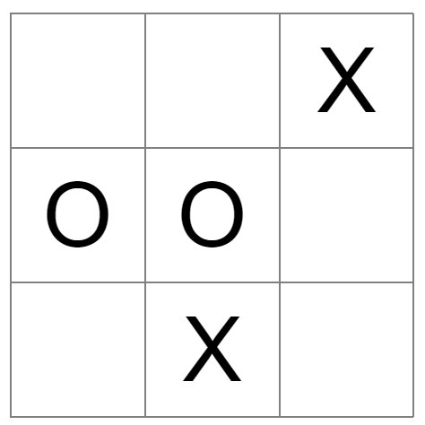

# Tic Tac Toe



**Этапы работ:**
1. Подготовим верстку;
2. Подготовка к игре:
   - создаем функцию `showResult()` вывода результата
   - делаем обработчик начала игры - `Replay`
   - делаем генератор поля `renderBoard()`
3. Обрабатываем нажатия по полю:
```js
field[0] = 'X'
renderBoard()
```
4. Определяем победителя
5. После выйгрыша не давать делать ходы
6. Определение ничьи
7. Реализуем запуск новой игры

**Что можно сделать еще?**
- Игра с компьютером;